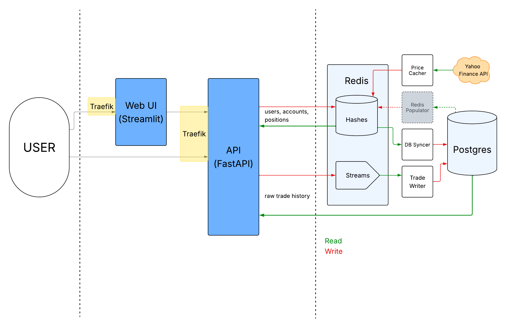

<div align="center">

# SPEND

### **S**calable **P**arallel **E**quity, **N**etworked & **D**istributed

*A Kubernetes-native equity position management platform*


</div>

---

## What it is

SPEND is a **position management system**. Users open accounts and book trades (long and short) one at a time or thousands at a time; SPEND records each one, derives the resulting positions and cost basis, and marks them to market against live prices.

The interesting part isn't the domain — it's the machine underneath it. SPEND is a genuinely distributed system: a **split hot/cold data path** where every write lands in Redis and is drained into Postgres asynchronously by a fleet of **Rust workers** that autoscale on queue depth. Every component is replicated, every failure mode is something we deliberately tested, and the entire cluster is defined declaratively and reconciled by **Flux** — no human ever runs `kubectl apply` against a real environment.

It runs identically on a laptop (k3d) or across a fleet of networked physical machines (K3s).

---

## Architecture



### The write path (hot)

A booked trade never touches Postgres synchronously. The API validates it, updates the appropriate position hash in Redis, and appends the trade to a Redis stream, then returns. Durable persistence happens out of band:

- **`trade-writer`**: a consumer-group worker that batches the trade stream into Postgres using a staging table plus upsert, so replays, retries and edits are idempotent. KEDA watches the stream's consumer lag and scales the worker pool 1 → 5 when a batch submission floods the queue.
- **`db-syncer`**: continuously mirrors users, accounts, positions and the username map from Redis into Postgres.

This is what makes bulk booking work: the user's request is bounded by a Redis round trip, not by Postgres write throughput, and the backlog is absorbed by workers that materialize on demand.

### The read path (cold)

Anything that needs individual trade data (single trade lookups, paginated trade history) reads Postgres directly through a pooled connection. Everything else (e.g. positions, accounts, ticker validation, live prices) reads Redis.

### Market data

`price-cacher` polls the Yahoo Finance API for the full S&P 500 and keeps current prices in Redis, so ticker validation and mark-to-market P&L are local lookups rather than outbound HTTP calls on the request path.

### Cold start & recovery

`redis-populator` is the inverse of `db-syncer`: a run-once Job that rebuilds the entire Redis cache from Postgres. It's how the system recovers from a total cache loss, and how a restored database dump gets promoted back into the hot path.

### Infrastructure & GitOps

The cluster is entirely declarative: every resource lives in Git and is continuously reconciled by **Flux CD**, staged across three ordered targets (`1-infra` → `2-data` → `3-apps`) so infrastructure, the data layer, and the apps that depend on them always come up in the right order. The same manifests run on **k3d** for local development and **K3s** for the distributed physical cluster, which is joined into a secure mesh network by the **Tailscale Kubernetes Operator**. The high-availability data layer is powered by **CloudNativePG**, which handles Postgres replication, failover, and connection pooling — PgBouncer runs as a CNPG-managed pooler rather than a standalone deployment — alongside **Redis Sentinel** behind an HAProxy proxy for the hot-path cache.

### Development workflow

To let the team develop against the same cluster without stepping on each other, the repo leans on **Kustomize**: a single `manifests/base/` defines every app, data-layer, and infrastructure resource, and each developer gets an isolated `overlays/dev-<name>/` overlay — `dev-sean`, `dev-yehuda`, `dev-max`, `dev-will` — plus a dedicated Flux target reconciling that overlay independently, so different image tags or replica counts never collide. `overlays/upstream/` is the production-like overlay Flux deploys by default; `overlays/k3s/` is the equivalent for the distributed remote cluster.

Command-line operations are easily accessible through modular Makefiles (`chaos.mk`, `db.mk`, `logs.mk`, and others, one per functional area), all of which run through the containerized **`k8s-toolbox`** — so nobody needs `kubectl`, `helm`, or `flux` installed locally. `cluster_up.sh` and the interactive `k3s_manager.sh` handle bootstrapping and tearing down the local and distributed clusters respectively, hiding the multi-stage Flux bootstrap behind a single command.

### Observability

**Loki**, **Prometheus**, and **Grafana** run as part of the cluster's monitoring manifests and are reconciled by Flux like everything else. Our most important dashboard — the custom CNPG/cluster-health view — is committed as dashboard JSON and provisioned directly; it includes a "Cluster Health" panel, an ALL SYSTEMS GO / DEGRADED stat rolled up from node and pod counts, alongside combined error/warning log panels sourced from Loki.

---

## The API

FastAPI, async throughout: an `asyncpg` pool for Postgres and a shared `redis.asyncio` connection pool sized from config. It refuses to start until both are reachable *and* Redis holds the S&P ticker set, retrying five times before failing the pod — better to let Kubernetes restart it than to serve requests against an empty cache.

- **Auth**: argon2 password hashing and a signed JWT delivered as a `session` cookie. Logout blacklists the token in Redis, so a logged-out session dies immediately instead of staying valid until it expires.
- **Pagination**: `/trades` uses keyset pagination — a `(created_at, trade_id)` tuple compared against the previous page's cursor — so page 100 costs what page 1 does. Filters (account, ticker, time range, own-trades-only) compose into one parameterized query.
- **Batch booking**: `POST /trade` always takes a list. Each trade is validated independently and the response partitions into `successes` and `failures` with a reason attached to each rejection, so one bad line in a thousand-row paste doesn't sink the rest.
- **Editing**: `PATCH /edit_trade/{trade_id}` reverts the position effect of the original trade before applying the amended one, so the derived position stays consistent with the trade history that produced it.
- **Failure translation**: middleware catches `asyncpg` and Redis exceptions and returns 503 rather than 500 — a data layer mid-failover is unavailable, not broken — and times every request on the way out.
- **Metrics**: `prometheus-fastapi-instrumentator` exposes `/metrics`, and the request-duration series it publishes is exactly what KEDA's Prometheus trigger reads to scale the API 2 → 20 replicas, alongside CPU and memory. The autoscaler is driven by the API's own instrumentation.

---

## The web UI

Streamlit, with `st.navigation` over a page-per-route layout and an auth guard in front of everything but login and register.

- **Grids**: positions and trade history render in AG Grid with per-column sorting and filtering, including a custom date-range comparator on the trade timestamps. Rows are flattened from whichever shape the endpoint returned, and P&L is broken out into realized, unrealized and total.
- **Live views**: position, trade and account views are `st.fragment(run_every=...)`, so they re-poll on their own without rerunning the whole script. The grids mount with `reload_data=False`; without it, every refresh tore down and rebuilt the entire client-side grid, which at a 6-second interval was frequent enough to make the component fail to load outright.
- **Mass booking**: paste CSV lines and get a parsed preview with a per-line validation status *before* anything is sent. On submit the payload is chunked into batches of 25 and posted across a five-worker thread pool, so a large paste goes out as several concurrent requests rather than one long serial one.
- **Session affinity**: the UI runs two replicas behind Traefik with a sticky cookie. Streamlit holds per-session state in the server process, so without pinning a browser to one pod, a mid-session request landing on the other replica finds no session at all.
- **Degradation**: every backend call goes through a wrapper that distinguishes "couldn't reach the API" from a genuine 401. A connection error shows a message and leaves the session intact; only a real 401 clears the login and redirects. Live prices come from `yfinance` behind a 30-second cache.

---

## Stack

| Layer | Technology |
| :--- | :--- |
| **API** | FastAPI · Pydantic · async Postgres + Redis pools · cookie session auth · request-timing middleware |
| **Web UI** | Streamlit · AG Grid · yfinance · multipage navigation with an auth guard |
| **Workers** | Rust — `trade-writer`, `db-syncer`, `price-cacher`, `redis-populator` |
| **Data** | Redis + Sentinel (HAProxy proxy) · PostgreSQL via CloudNativePG, with CNPG-managed PgBouncer poolers · Adminer · RedisInsight |
| **Orchestration** | Kubernetes (k3d local / K3s distributed) · Kustomize · Flux CD · Traefik ingress · KEDA · Reloader |
| **Observability** | Loki · Prometheus · Grafana |
| **Testing & CI** | Locust · GitHub Actions (full cluster bootstrap per PR, multi-arch image publishing) |
| **Networking** | Tailscale Kubernetes Operator |

---

## Repository layout

```
├── api/         FastAPI backend
├── web-ui/      Streamlit frontend
├── db/          Schema + Rust syncers
├── k8s/         Manifests, overlays, Flux
├── locust/      Load testing
├── make/        Modular developer toolbox
└── cluster_up.sh · cluster_down.sh · k3s_manager.sh
```

---

## Quickstart

Bring up the whole system locally — k3d cluster, Flux bootstrap, and every service:

```sh
make cluster-up
make status      # watch it come alive
make down
```

There is nothing to install first. Every cluster command runs inside a containerized `k8s-toolbox` that carries its own `kubectl`, `k3d` and `flux` and mounts the host's Docker/Podman socket — so no host-level Kubernetes tooling is required.

`make help` lists the full toolbox: `make logs-api`, `make psql`, `make redis-cli`, `make db-backup`, `make bounce`, `make chaos`, and more.

**Deploying a distributed K3s cluster?** Use the interactive manager:

```sh
curl -sSL "https://raw.githubusercontent.com/SM26-Industrial-Software-Dev/SPEND/main/k3s_manager.sh" -o k3s_manager.sh && chmod +x k3s_manager.sh
```

Full setup, overlay and debugging documentation lives in **[DEVELOPERS.md](DEVELOPERS.md)**.

---

## The team

#### [Sean Alter](https://github.com/thegreatestgiant) — Kubernetes, GitOps & infrastructure

Owns everything under `k8s/`: the base/overlay Kustomize structure and per-developer environments, and the staged Flux reconciliation targets. Owns the data layer — Redis Sentinel and its HAProxy proxy, the CloudNativePG cluster and its poolers — plus liveness probes, anti-affinity and eviction tuning. Built and maintains the observability stack (Loki, Prometheus, Grafana), including dashboard provisioning and the cluster-health panels, and the modular Make-based developer toolbox (`k8s-toolbox` plus the `make/*.mk` targets) the rest of the team uses to run the cluster without installing tooling locally. Wrote `cluster_up.sh` and the interactive `k3s_manager.sh`, stood up the distributed K3s cluster and its Tailscale operator integration, hardened session cookies at the ingress, and built the chaos-testing and database backup/restore tooling. Contributed UI work throughout.

#### [Yehuda Cohen](https://github.com/YSCohen) — Rust workers, data model & CI

Wrote the Rust syncer binaries: the `trade-writer` consumer-group worker with its staging-table upsert strategy, `db-syncer`, `price-cacher`, and the `redis-populator` bootstrap Job. Owns the Postgres schema (including the `NUMERIC` cost-basis and realized-gains model and the username map), and the project's documentation and licensing.

#### [Max Rabinowitz](https://github.com/MaxRabz) — FastAPI backend

Built the API: routers, services, models, and the core Redis/Postgres connection layer. Implemented authentication, account creation and cross-user account permission sharing, P&L calculation for both long and short positions, trade editing that also corrects the affected position, batch booking with per-trade failure reporting, and cursor-based pagination over trade history. Wrote the request-logging middleware, moved ticker validation from a CSV to Redis, and authored the Locust scenarios that drive the load tests.

#### [William Trump](https://github.com/WilliamTrump) — Streamlit web UI

Built the frontend: the filterable AG Grid position and trade views, the mass trade booker, account management flows, and persistent login that survives refreshes and deep links. Did the performance work that made a heavyweight JS grid viable in Streamlit — gzip-compressing the AG Grid bundle at the ingress, deferring imports, and stopping the grid from fully reinitializing on every auto-refresh cycle.

---

## License

[Apache 2.0](LICENSE)
